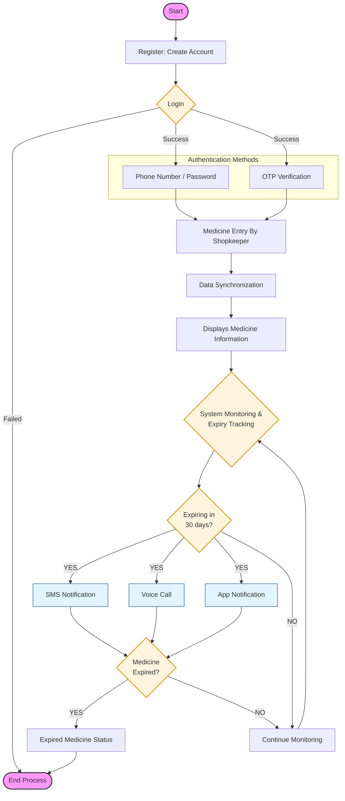

# 📋 MediTrack Application Flowchart

You can use the **Mermaid** code below to recreate this in [draw.io](https://app.diagrams.net/). 

### 🛠️ How to use in draw.io:
1. Open **draw.io**.
2. Click **+** (Insert) in the toolbar.
3. Select **Advanced** > **Mermaid**.
4. Paste the code below and click **Insert**.

